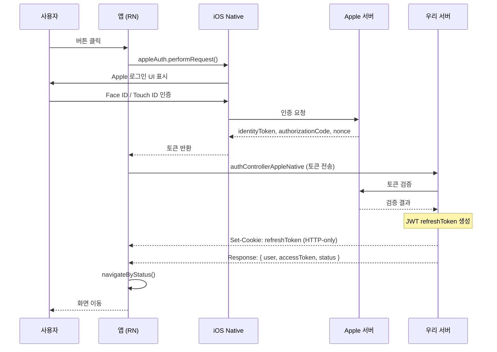
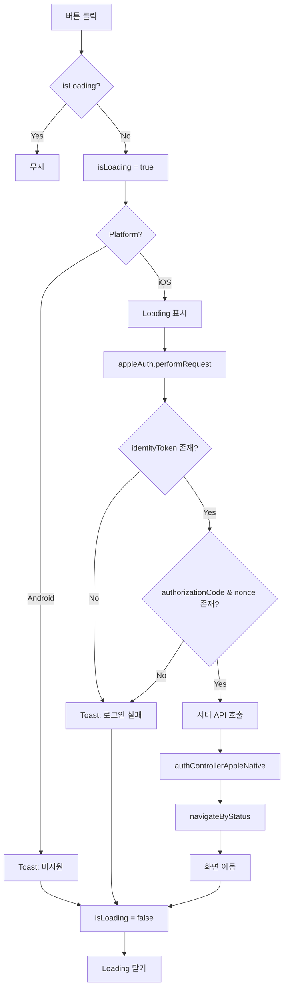

# AppleLoginButton

Apple 소셜 로그인 버튼 컴포넌트입니다.

## 사용 라이브러리

- `@invertase/react-native-apple-authentication`

## 시퀀스 다이어그램



## 플로우 다이어그램



## 플로우 설명

### iOS

1. `appleAuth.performRequest()`로 Apple 인증 요청 (클라이언트 → Apple)
   - `requestedOperation`: LOGIN
   - `requestedScopes`: EMAIL
   - `nonceEnabled`: true
2. Apple이 `identityToken`, `authorizationCode`, `nonce` 반환 (클라이언트로)
3. 서버 API (`authControllerAppleNative`) 호출 (클라이언트 → 우리 서버)
4. 서버에서 Apple에 토큰 검증 (우리 서버 → Apple)
5. 서버가 JWT refreshToken 생성 후 **HTTP-only 쿠키**로 설정
6. 응답 body로 `{ user, accessToken, status }` 반환
7. `navigateByStatus()`로 응답 상태에 따라 화면 이동

### Android

- 현재 미지원 (Toast 메시지 표시)

## 서버 요청 데이터

```typescript
// 클라이언트 → 서버
{
  identityToken: string;
  email?: string;
  authorizationCode?: string;
  nonce?: string;
}
```

## 서버 응답 데이터

```typescript
// 서버 → 클라이언트
// Header: Set-Cookie: refreshToken=xxx (HTTP-only, 180일)
// Body:
{
  ...user,           // 사용자 정보
  accessToken: string;
  status: string;    // 사용자 상태
}
```

## 에러 처리

- 중복 클릭 방지를 위한 `isLoading` 상태 관리
- `TouchableOpacity`에 `disabled={isLoading}` 적용

## 파일 위치

`src/screens/Settings/AppleLoginButton.tsx`
