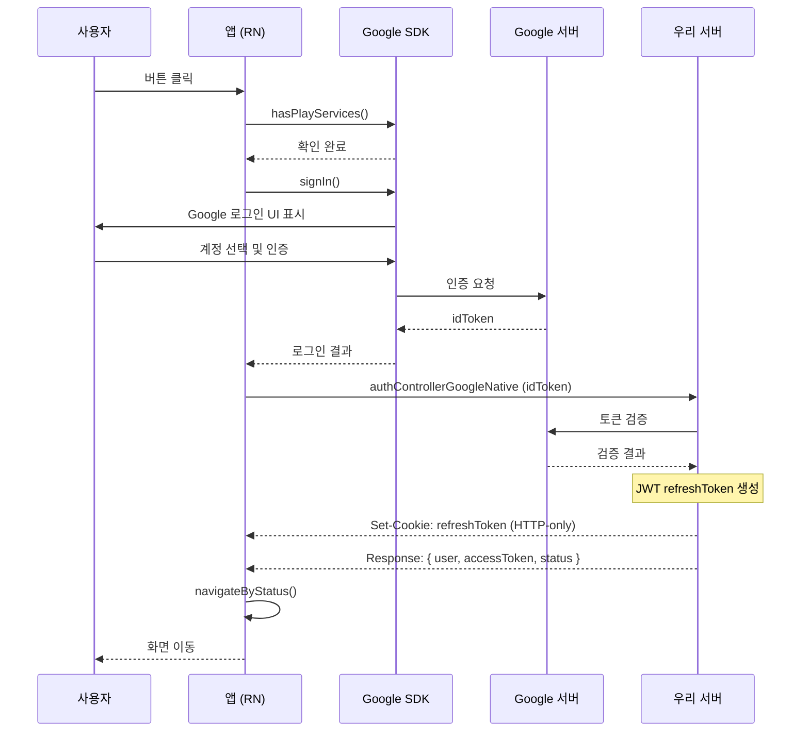
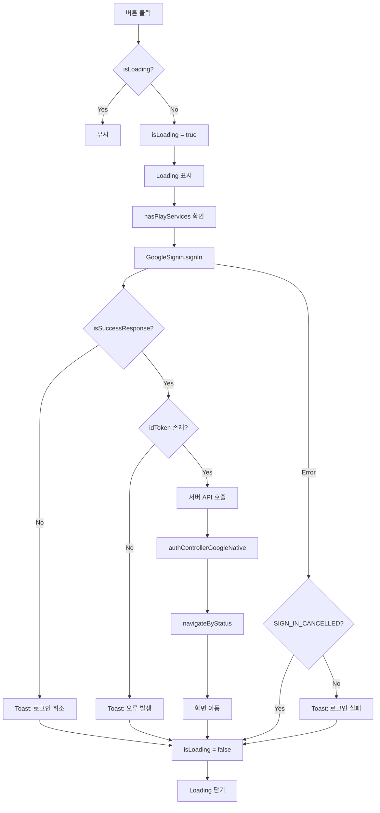

# GoogleLoginButton

Google 소셜 로그인 버튼 컴포넌트입니다.

## 사용 라이브러리

- `@react-native-google-signin/google-signin`

## 시퀀스 다이어그램



## 플로우 다이어그램



## 플로우 설명

1. `GoogleSignin.hasPlayServices()`로 Play Services 확인
2. `GoogleSignin.signIn()`으로 Google 로그인 수행 (클라이언트 → Google)
3. `isSuccessResponse()`로 성공 여부 확인
4. 응답에서 `idToken` 추출
5. 서버 API (`authControllerGoogleNative`) 호출 (클라이언트 → 우리 서버)
6. 서버에서 Google에 토큰 검증 (우리 서버 → Google)
7. 서버가 JWT refreshToken 생성 후 **HTTP-only 쿠키**로 설정
8. 응답 body로 `{ user, accessToken, status }` 반환
9. `navigateByStatus()`로 응답 상태에 따라 화면 이동

## 서버 요청 데이터

```typescript
// 클라이언트 → 서버
{
  idToken: string;
}
```

## 서버 응답 데이터

```typescript
// 서버 → 클라이언트
// Header: Set-Cookie: refreshToken=xxx (HTTP-only, 180일)
// Body:
{
  ...user,           // 사용자 정보
  accessToken: string;
  status: string;    // 사용자 상태
}
```

## 에러 처리

- `SIGN_IN_CANCELLED` 포함 에러는 사용자 취소로 간주하여 Toast 미표시
- 중복 클릭 방지를 위한 `isLoading` 상태 관리
- `TouchableOpacity`에 `disabled={isLoading}` 적용

## 파일 위치

`src/screens/Settings/GoogleLoginButton.tsx`
