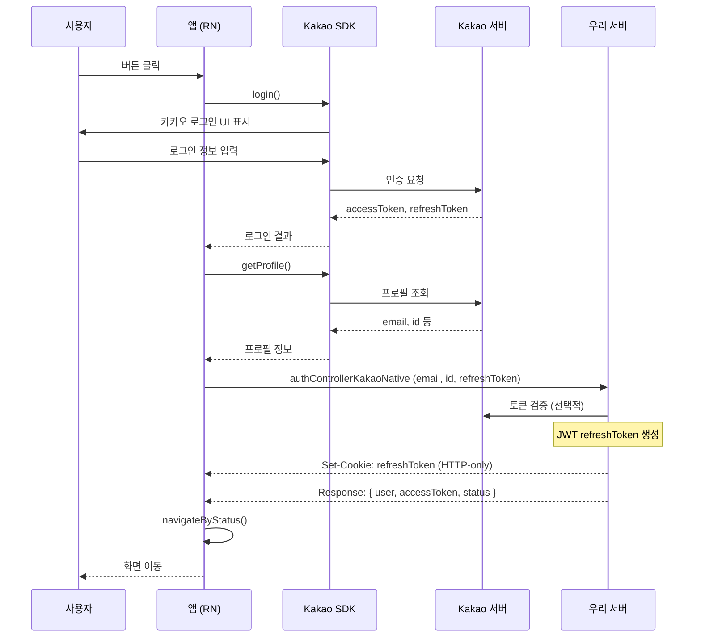
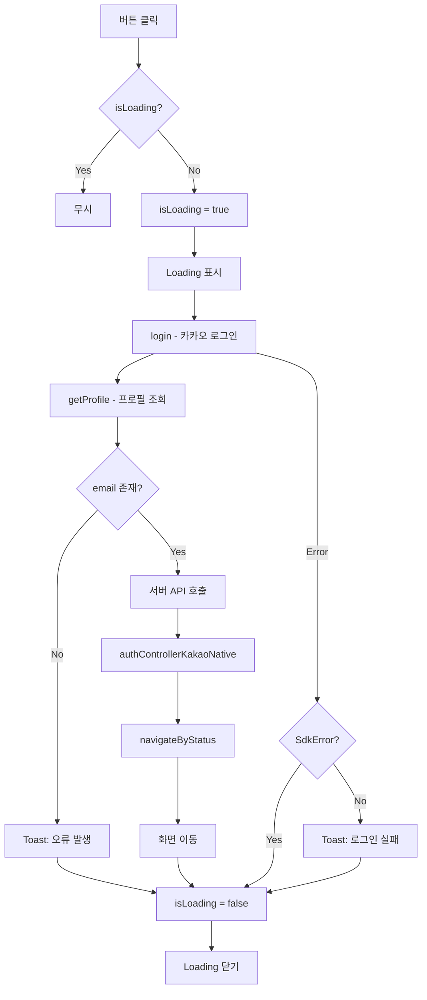

# KakaoLoginButton

카카오 소셜 로그인 버튼 컴포넌트입니다.

## 사용 라이브러리

- `@react-native-seoul/kakao-login`

## 시퀀스 다이어그램



## 플로우 다이어그램



## 플로우 설명

1. `login()`으로 카카오 로그인 수행 (클라이언트 → Kakao)
2. `getProfile()`로 사용자 정보 조회 (클라이언트 → Kakao)
3. 서버 API (`authControllerKakaoNative`) 호출 (클라이언트 → 우리 서버)
4. 서버가 JWT refreshToken 생성 후 **HTTP-only 쿠키**로 설정
5. 응답 body로 `{ user, accessToken, status }` 반환
6. `navigateByStatus()`로 응답 상태에 따라 화면 이동

## 서버 요청 데이터

```typescript
// 클라이언트 → 서버
{
  email: string;
  id: string;
  refreshToken: string;  // 카카오 refreshToken
}
```

## 서버 응답 데이터

```typescript
// 서버 → 클라이언트
// Header: Set-Cookie: refreshToken=xxx (HTTP-only, 180일)
// Body:
{
  ...user,           // 사용자 정보
  accessToken: string;
  status: string;    // 사용자 상태
}
```

## 에러 처리

- `KakaoSDKCommon.SdkError` 포함 에러는 사용자 취소로 간주하여 Toast 미표시
- 중복 클릭 방지를 위한 `isLoading` 상태 관리
- `TouchableOpacity`에 `disabled={isLoading}` 적용

## 파일 위치

`src/screens/Settings/KakaoLoginButton.tsx`
